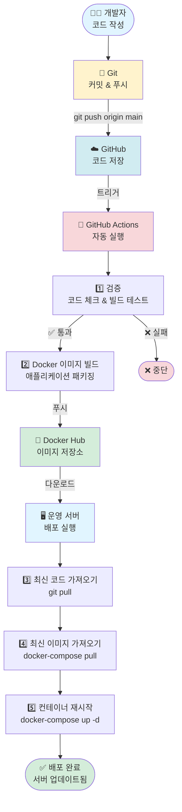
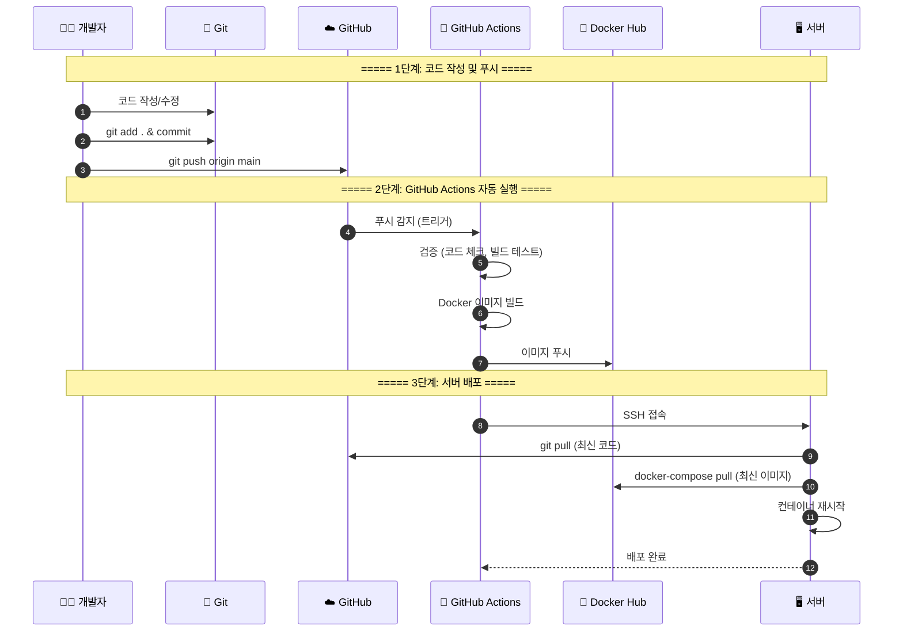
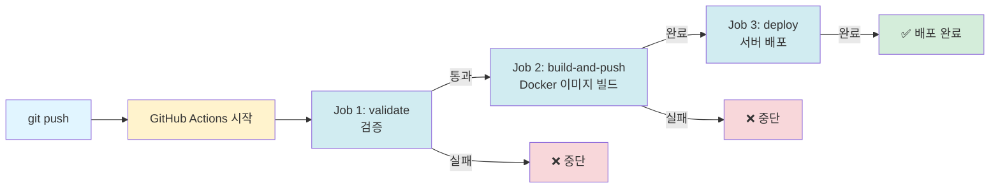
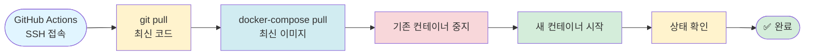
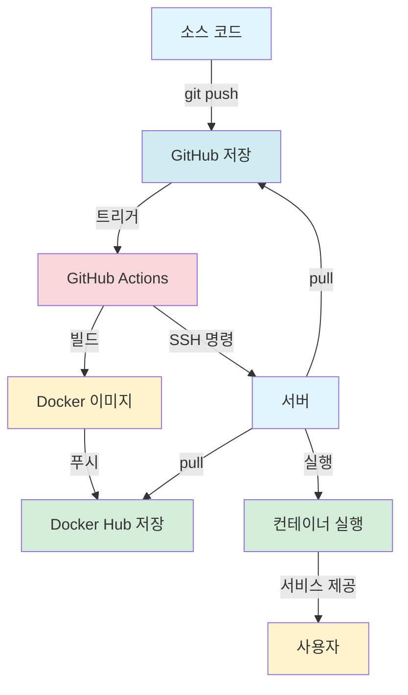
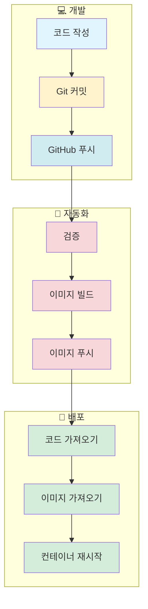

# 🚀 소스 반영 및 배포 로직 구조 (간단 버전)

## 핵심 구조 다이어그램



---

## 단계별 상세 구조



---

## GitHub Actions 3단계 구조



---

## 서버 배포 과정 구조



---

## 전체 데이터 흐름



---

## 핵심 개념 구조



---

## 간단 요약

```
개발자 코드 작성
    ↓
Git 커밋 & 푸시
    ↓
GitHub 저장
    ↓
GitHub Actions 자동 실행
    ├─ 검증 (코드 체크)
    ├─ Docker 이미지 빌드
    └─ Docker Hub 푸시
    ↓
서버 배포
    ├─ 최신 코드 가져오기
    ├─ 최신 이미지 가져오기
    └─ 컨테이너 재시작
    ↓
배포 완료 ✅
```


