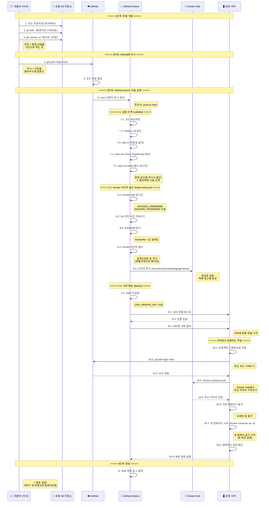

# 🎓 개발부터 배포까지 전체 과정 가이드 (초보자용)

## 📚 목차
1. [전체 과정 개요](#전체-과정-개요)
2. [도커(Docker) 이해하기 - 비유로 쉽게](#도커docker-이해하기---비유로-쉽게)
3. [Git 이해하기](#git-이해하기)
4. [GitHub Actions 이해하기](#github-actions-이해하기)
5. [전체 시퀀스 다이어그램](#전체-시퀀스-다이어그램)
6. [단계별 상세 설명](#단계별-상세-설명)

---

## 전체 과정 개요

### 🎯 목표
**커서(Cursor)에서 코드를 작성하고 → GitHub에 올리고 → 자동으로 서버에 배포되는 전체 과정을 이해하기**

### 📋 간단 요약
```
1. 로컬 개발 (커서에서 코딩)
   ↓
2. Git으로 변경사항 저장 및 푸시
   ↓
3. GitHub Actions가 자동으로 실행
   ↓
4. Docker 이미지 빌드 및 배포
   ↓
5. 서버에서 자동으로 업데이트
```

---

## 도커(Docker) 이해하기 - 비유로 쉽게

### 🏠 집짓기 비유

#### 1. **Dockerfile = 집 설계도**
- 집을 어떻게 지을지 적어놓은 설계도
- "1층에는 거실, 2층에는 침실, 화장실은 어디에..." 같은 것
- 예: `Dockerfile`에는 "Node.js 18 설치, 코드 복사, 빌드 실행" 등이 적혀있음

#### 2. **Docker Image (이미지) = 완성된 집**
- 설계도를 따라 지은 완성된 집
- 이 집은 어디서든 똑같이 사용할 수 있음
- 예: `docckerchoi/marketingpage:latest` = 완성된 애플리케이션 패키지

#### 3. **Docker Container (컨테이너) = 집에서 실제로 살기**
- 완성된 집(이미지)을 실제로 사용하는 것
- 집은 하나인데, 여러 가족이 각각 다른 집에서 살 수 있음
- 예: 개발용 컨테이너, 운영용 컨테이너

#### 4. **docker-compose.yml = 아파트 단지 관리**
- 여러 집(컨테이너)을 한 번에 관리
- "1동은 웹서버, 2동은 데이터베이스" 같은 것
- 예: `docker-compose.prod.yml` = 운영 환경 전체 설정

### 🎁 선물 상자 비유

#### **Docker Image = 선물 상자**
- 선물을 포장한 상자
- 상자 안에는 애플리케이션과 필요한 모든 것(라이브러리, 설정 등)이 들어있음
- 이 상자는 어디서든 열면 똑같은 내용이 나옴

#### **Docker Hub = 택배 창고**
- 완성된 선물 상자들을 보관하는 창고
- 누구나 이 창고에서 상자를 가져가서 사용할 수 있음
- 예: `docker pull docckerchoi/marketingpage:latest` = 창고에서 상자 가져오기

#### **Container = 상자 열어서 사용하기**
- 선물 상자를 열어서 실제로 사용하는 것
- 상자는 하나인데, 여러 곳에서 열어서 사용할 수 있음

### 🍔 햄버거 비유

#### **Dockerfile = 햄버거 레시피**
- "빵, 패티, 야채, 소스 순서로 쌓기" 같은 레시피

#### **Docker Image = 완성된 햄버거**
- 레시피대로 만든 완성된 햄버거
- 이 햄버거는 어디서든 똑같은 맛

#### **Docker Container = 햄버거 먹기**
- 완성된 햄버거를 실제로 먹는 것

### 💡 왜 도커를 사용할까?

#### **문제: "내 컴퓨터에서는 되는데..."**
- 개발자 A: "내 컴퓨터에서는 잘 되는데요?"
- 개발자 B: "제 컴퓨터에서는 안 되는데요?"
- 서버: "제 서버에서는 또 다르게 나오는데요?"

#### **해결: 도커 = 똑같은 환경 보장**
- 도커를 사용하면 **어디서든 똑같은 환경**에서 실행됨
- 개발자 컴퓨터, 서버, 다른 개발자 컴퓨터 모두 똑같음!

---

## Git 이해하기

### 📝 Git = 시간 여행기

#### **커밋(Commit) = 사진 찍기**
- 코드의 현재 상태를 사진으로 찍는 것
- "이 순간의 코드 상태를 저장하겠다!"

#### **푸시(Push) = 사진을 클라우드에 업로드**
- 찍은 사진을 GitHub(클라우드)에 올리는 것
- 다른 사람도 이 사진을 볼 수 있게 됨

#### **풀(Pull) = 클라우드에서 사진 다운로드**
- GitHub에 있는 최신 사진을 내 컴퓨터로 가져오는 것

### 🗂️ 브랜치(Branch) = 다른 버전

#### **main 브랜치 = 정식 버전**
- 실제로 사용하는 정식 버전
- 여기에 푸시하면 자동으로 배포됨

#### **개발 브랜치 = 실험 버전**
- 새로운 기능을 테스트하는 버전
- 실험하다가 잘 되면 main에 합침

---

## GitHub Actions 이해하기

### 🤖 GitHub Actions = 자동화 로봇

#### **역할: 코드가 GitHub에 올라오면 자동으로 일을 해주는 로봇**

### 📋 이 프로젝트에서 하는 일

#### **1단계: 검증 (Validate)**
```
로봇: "코드가 제대로 작성되었는지 확인하겠습니다!"
- TypeScript 문법 체크
- 빌드가 제대로 되는지 테스트
- 문제가 있으면 여기서 멈춤!
```

#### **2단계: Docker 이미지 만들기 (Build & Push)**
```
로봇: "애플리케이션을 포장해서 Docker Hub에 올리겠습니다!"
- Dockerfile을 읽어서 이미지 생성
- 완성된 이미지를 Docker Hub에 업로드
- 나중에 서버에서 이 이미지를 가져다 쓸 수 있게 함
```

#### **3단계: 서버에 배포 (Deploy)**
```
로봇: "서버에 접속해서 새 버전으로 업데이트하겠습니다!"
- SSH로 서버에 접속
- Docker Hub에서 최신 이미지 가져오기
- 기존 컨테이너 중지하고 새 컨테이너 시작
- 배포 완료!
```

### 🔑 GitHub Secrets = 로봇의 비밀번호

로봇이 일을 하려면 비밀번호가 필요함:
- `DOCKER_USERNAME`: Docker Hub 아이디
- `DOCKER_PASSWORD`: Docker Hub 비밀번호
- `SSH_PRIVATE_KEY`: 서버 접속용 비밀키
- `SSH_HOST`: 서버 주소
- `SSH_USER`: 서버 사용자 이름

이 비밀번호들은 GitHub 저장소의 Settings → Secrets에 저장됨

---

## 전체 시퀀스 다이어그램



---

## 단계별 상세 설명

### 📍 1단계: 로컬 개발 (커서에서)

#### **1-1. 코드 작성/수정**
```
커서(Cursor)에서 파일을 열고 코드를 작성하거나 수정합니다.
예: useScrollBackground.ts 파일 수정
```

#### **1-2. Git 스테이징 (git add)**
```bash
git add .
```
**의미**: "이 파일들의 변경사항을 기록하겠다!"
- `.` = 현재 폴더의 모든 변경사항
- 변경사항을 "스테이징 영역"에 추가

#### **1-3. Git 커밋 (git commit)**
```bash
git commit -m "스크롤 배경 효과 개선"
```
**의미**: "현재 상태를 사진으로 찍겠다!"
- `-m "메시지"` = 이 변경사항에 대한 설명
- 커밋 = 코드의 특정 시점을 저장

**비유**: 
- 사진 찍기 전: "이 순간을 기억하고 싶어!"
- 사진 찍기: 커밋
- 사진 앨범: Git 히스토리

---

### 📍 2단계: GitHub에 푸시

#### **2-1. 푸시 (git push)**
```bash
git push origin main
```
**의미**: "로컬에 찍은 사진을 GitHub(클라우드)에 업로드하겠다!"

**비유**:
- 로컬 Git = 내 컴퓨터의 사진 앨범
- GitHub = 클라우드 사진 저장소
- 푸시 = 클라우드에 업로드

**결과**: GitHub에 코드가 업로드됨

---

### 📍 3단계: GitHub Actions 자동 실행

#### **트리거 (Trigger)**
```yaml
on:
  push:
    branches:
      - main
```
**의미**: "main 브랜치에 푸시되면 자동으로 실행!"

**비유**: 
- 문 앞에 센서 설치
- 누군가 문을 열면(푸시) 자동으로 불이 켜짐(Actions 실행)

---

### 📍 3-1. 검증 단계 (validate)

#### **목적**: 코드가 제대로 작성되었는지 확인

#### **단계별 설명**:

**7-1. 코드 체크아웃**
```yaml
- uses: actions/checkout@v3
```
**의미**: "GitHub에서 코드를 가져오겠다!"
- Actions가 실행되는 가상 컴퓨터에 코드 복사

**7-2. Node.js 설정**
```yaml
- uses: actions/setup-node@v3
  with:
    node-version: '18'
```
**의미**: "Node.js 18 버전을 설치하겠다!"
- 애플리케이션 실행에 필요한 환경 설정

**7-3. 의존성 설치**
```bash
npm ci
```
**의미**: "필요한 라이브러리들을 설치하겠다!"
- `package.json`에 적힌 라이브러리들 설치
- 예: React, Express, TypeScript 등

**7-4. TypeScript 타입 체크**
```bash
npm run check
```
**의미**: "코드에 문법 오류가 없는지 확인하겠다!"
- TypeScript 컴파일러로 코드 검사
- 오류가 있으면 여기서 실패!

**7-5. 빌드 테스트**
```bash
npm run build
```
**의미**: "실제로 빌드가 되는지 테스트하겠다!"
- 개발 코드를 실행 가능한 형태로 변환
- 빌드 실패하면 여기서 실패!

**✅ 통과하면**: 다음 단계로 진행

---

### 📍 3-2. Docker 이미지 빌드 (build-and-push)

#### **목적**: 애플리케이션을 포장해서 Docker Hub에 올리기

#### **비유**: 집 짓기
- Dockerfile = 설계도
- Docker Image = 완성된 집
- Docker Hub = 택배 창고

#### **단계별 설명**:

**8-1. Docker Hub 로그인**
```yaml
- uses: docker/login-action@v3
  with:
    username: ${{ secrets.DOCKER_USERNAME }}
    password: ${{ secrets.DOCKER_PASSWORD }}
```
**의미**: "Docker Hub에 로그인하겠다!"
- Docker Hub에 이미지를 올리려면 로그인 필요
- GitHub Secrets에서 비밀번호 가져오기

**8-2. Git 커밋 시간 가져오기**
```bash
COMMIT_TIME=$(git log -1 --format=%ci)
```
**의미**: "언제 커밋했는지 기록하겠다!"
- 이미지에 빌드 시간 정보 포함

**8-3. Dockerfile 읽기**
```yaml
file: ./Dockerfile
```
**의미**: "설계도를 읽겠다!"

**Dockerfile 내용**:
```dockerfile
FROM node:18-alpine        # 기본 재료: Node.js 18
WORKDIR /app               # 작업 공간: /app 폴더
COPY package*.json ./      # 재료 준비: package.json 복사
RUN npm ci                 # 재료 설치: 라이브러리 설치
COPY . .                   # 재료 준비: 코드 복사
RUN npm run build          # 집 짓기: 빌드 실행
EXPOSE 8080                # 문 열기: 8080 포트 열기
CMD ["npm", "start"]       # 집 사용하기: 서버 시작
```

**비유**:
1. `FROM node:18-alpine` = "Node.js 18이 설치된 기본 땅을 사겠다"
2. `WORKDIR /app` = "작업할 공간을 만들겠다"
3. `COPY package*.json` = "필요한 재료 목록을 가져오겠다"
4. `RUN npm ci` = "재료들을 구매하겠다"
5. `COPY . .` = "집 설계도를 가져오겠다"
6. `RUN npm run build` = "집을 짓겠다"
7. `EXPOSE 8080` = "집 문을 열겠다"
8. `CMD ["npm", "start"]` = "집에서 살기 시작하겠다"

**8-4. Docker 이미지 빌드**
```yaml
- uses: docker/build-push-action@v5
  with:
    context: .
    push: true
    tags: docckerchoi/marketingpage:latest
```
**의미**: "설계도대로 집을 짓고, 택배 창고에 보관하겠다!"

**과정**:
1. Dockerfile 읽기
2. 각 단계 실행 (FROM, COPY, RUN 등)
3. 최종 이미지 생성
4. 이미지에 이름 태그: `docckerchoi/marketingpage:latest`

**비유**:
- 설계도 읽기 → 재료 준비 → 집 짓기 → 완성된 집에 주소 붙이기

**8-5. Docker Hub에 푸시**
```yaml
push: true
tags: docckerchoi/marketingpage:latest
```
**의미**: "완성된 집을 택배 창고(Docker Hub)에 보관하겠다!"

**결과**: 
- Docker Hub에 `docckerchoi/marketingpage:latest` 이미지 저장
- 나중에 서버에서 이 이미지를 가져다 쓸 수 있음

---

### 📍 3-3. 서버 배포 (deploy)

#### **목적**: 서버에 접속해서 새 버전으로 업데이트

#### **비유**: 새 집으로 이사하기
- 기존 집(컨테이너) 철거
- 새 집(새 이미지)으로 이사

#### **단계별 설명**:

**9-1. SSH 키 설정**
```yaml
- name: SSH 키 설정
  run: |
    echo "${{ secrets.SSH_PRIVATE_KEY }}" > ~/.ssh/id_ed25519
    chmod 600 ~/.ssh/id_ed25519
```
**의미**: "서버에 접속하기 위한 열쇠를 준비하겠다!"
- SSH = 서버에 안전하게 접속하는 방법
- SSH 키 = 서버 문을 여는 열쇠

**비유**:
- 서버 = 집
- SSH 키 = 집 열쇠
- GitHub Secrets = 열쇠 보관함

**9-2. SSH 연결 테스트**
```bash
ssh ${{ secrets.SSH_USER }}@${{ secrets.SSH_HOST }} echo "SSH 연결 성공!"
```
**의미**: "서버에 접속할 수 있는지 테스트하겠다!"
- 연결 성공하면 다음 단계로

**9-3. 서버에 접속해서 명령 실행**

**10-1. 프로젝트 디렉토리로 이동**
```bash
cd ~/marketingPage
```
**의미**: "프로젝트 폴더로 이동하겠다!"

**10-2. Git에서 최신 코드 가져오기**
```bash
git pull origin main
```
**의미**: "GitHub에서 최신 코드를 가져오겠다!"
- 서버에도 코드가 있어야 함 (docker-compose.yml 등)

**10-3. Docker Hub에서 최신 이미지 가져오기**
```bash
docker-compose -f docker-compose.prod.yml pull
```
**의미**: "Docker Hub에서 최신 이미지를 가져오겠다!"

**비유**:
- Docker Hub = 택배 창고
- `pull` = 창고에서 상자 가져오기
- `docker-compose.prod.yml` = 어떤 상자를 가져올지 적힌 주문서

**10-4. 기존 컨테이너 중지**
```bash
docker-compose -f docker-compose.prod.yml down
```
**의미**: "기존에 실행 중인 애플리케이션을 중지하겠다!"

**비유**: 오래된 집에서 나오기

**10-5. 새 컨테이너 시작**
```bash
docker-compose -f docker-compose.prod.yml up -d
```
**의미**: "새 이미지로 애플리케이션을 시작하겠다!"

**비유**: 새 집에서 살기 시작

**과정**:
1. `docker-compose.prod.yml` 읽기
2. 이미지 확인: `docckerchoi/marketingpage:latest`
3. 컨테이너 생성 및 시작
4. 포트 매핑: 8080:8080
5. 환경 변수 설정
6. 백그라운드 실행 (`-d`)

**10-6. 컨테이너 상태 확인**
```bash
docker-compose -f docker-compose.prod.yml ps
```
**의미**: "컨테이너가 제대로 실행되고 있는지 확인하겠다!"

**10-7. 로그 확인**
```bash
docker-compose -f docker-compose.prod.yml logs --tail=20 app
```
**의미**: "애플리케이션이 제대로 시작되었는지 로그를 확인하겠다!"

---

### 📍 4단계: 완료

#### **결과**
- ✅ 서버가 새 버전으로 업데이트됨
- ✅ 사용자들이 새 버전을 사용할 수 있음
- ✅ 서버 주소: `http://35.237.229.92:8080`

---

## 🔄 전체 과정 요약

### **개발자 관점**
1. 커서에서 코드 작성
2. `git add .` → `git commit -m "메시지"` → `git push`
3. GitHub Actions가 자동으로 나머지 처리
4. 몇 분 후 서버에 반영됨

### **GitHub Actions 관점**
1. 코드 검증 (문법 체크, 빌드 테스트)
2. Docker 이미지 빌드 및 Docker Hub 업로드
3. 서버에 접속해서 새 버전 배포

### **서버 관점**
1. GitHub에서 최신 코드 가져오기
2. Docker Hub에서 최신 이미지 가져오기
3. 기존 컨테이너 중지
4. 새 컨테이너 시작
5. 배포 완료!

---

## 💡 핵심 개념 정리

### **Docker**
- **이미지**: 완성된 애플리케이션 패키지 (선물 상자)
- **컨테이너**: 이미지를 실행한 것 (상자 열어서 사용)
- **Docker Hub**: 이미지를 보관하는 창고
- **Dockerfile**: 이미지를 만드는 설계도

### **Git**
- **커밋**: 코드 상태를 저장 (사진 찍기)
- **푸시**: 로컬 저장소를 GitHub에 업로드
- **풀**: GitHub에서 최신 코드 가져오기

### **GitHub Actions**
- **워크플로우**: 자동화된 작업 흐름
- **트리거**: 워크플로우를 시작하는 이벤트 (예: push)
- **Secrets**: 비밀번호 같은 민감한 정보 저장

---

## 🎯 실전 예시

### **시나리오: 버튼 색상 변경**

#### **1. 로컬 개발**
```bash
# 커서에서 Button.tsx 파일 수정
# 빨간색 → 파란색으로 변경
```

#### **2. Git 커밋 및 푸시**
```bash
git add .
git commit -m "버튼 색상을 파란색으로 변경"
git push origin main
```

#### **3. GitHub Actions 자동 실행**
- 코드 검증 ✅
- Docker 이미지 빌드 ✅
- Docker Hub 업로드 ✅
- 서버 배포 ✅

#### **4. 결과**
- 약 5-10분 후 서버에 반영됨
- 사용자들이 새 버튼 색상을 볼 수 있음

---

## 📚 추가 학습 자료

### **Docker 더 배우기**
- Docker 공식 문서: https://docs.docker.com/
- Docker 입문 강의 (한국어): 다양한 온라인 강의

### **Git 더 배우기**
- Git 공식 문서: https://git-scm.com/doc
- Git 입문 강의 (한국어): 다양한 온라인 강의

### **GitHub Actions 더 배우기**
- GitHub Actions 공식 문서: https://docs.github.com/en/actions
- 워크플로우 예제: https://github.com/actions/starter-workflows

---

## ❓ 자주 묻는 질문 (FAQ)

### **Q1: 왜 Docker를 사용하나요?**
**A**: 어디서든 똑같은 환경에서 실행되도록 보장하기 위해. "내 컴퓨터에서는 되는데..." 문제를 해결합니다.

### **Q2: GitHub Actions는 언제 실행되나요?**
**A**: `main` 브랜치에 `git push`할 때마다 자동으로 실행됩니다.

### **Q3: 배포에 얼마나 걸리나요?**
**A**: 보통 5-10분 정도 걸립니다. 코드 검증(1-2분) + 이미지 빌드(2-3분) + 배포(1-2분)

### **Q4: 배포 중에 서비스가 중단되나요?**
**A**: 매우 짧은 시간(몇 초) 동안 중단될 수 있습니다. 컨테이너를 교체하는 동안입니다.

### **Q5: 실수로 잘못된 코드를 푸시했어요!**
**A**: 다시 수정해서 푸시하면 됩니다. GitHub Actions가 새로 실행되어 올바른 버전으로 배포됩니다.

---

## 🎉 축하합니다!

이제 전체 개발-배포 과정을 이해하셨습니다! 
커서에서 코드를 작성하고 `git push`만 하면 나머지는 자동으로 처리됩니다. 🚀


