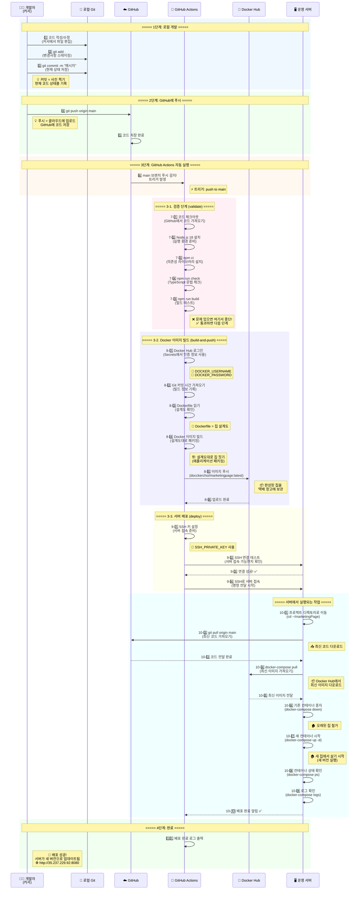
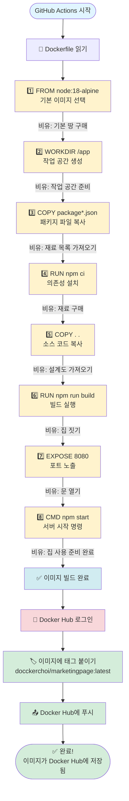
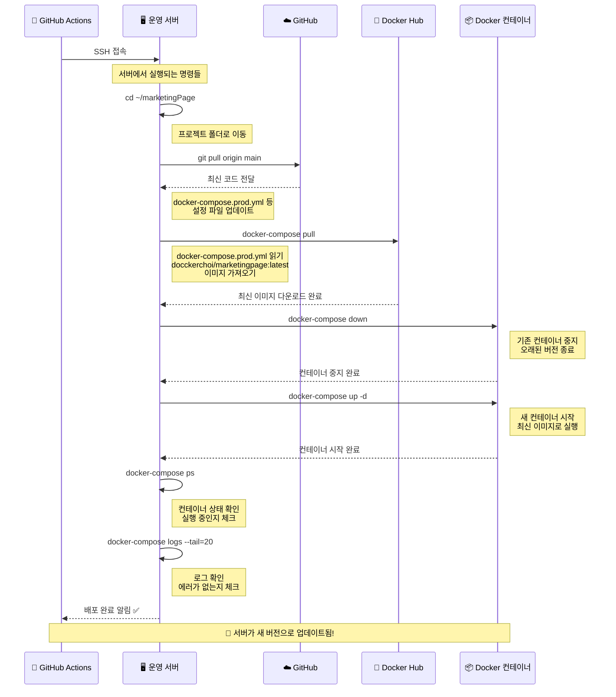
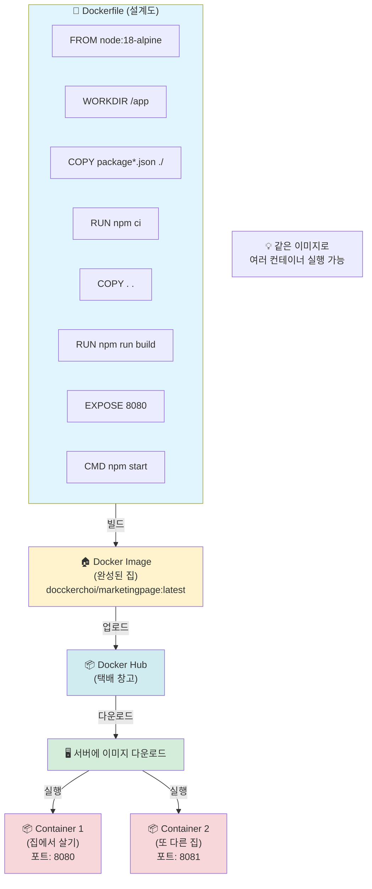
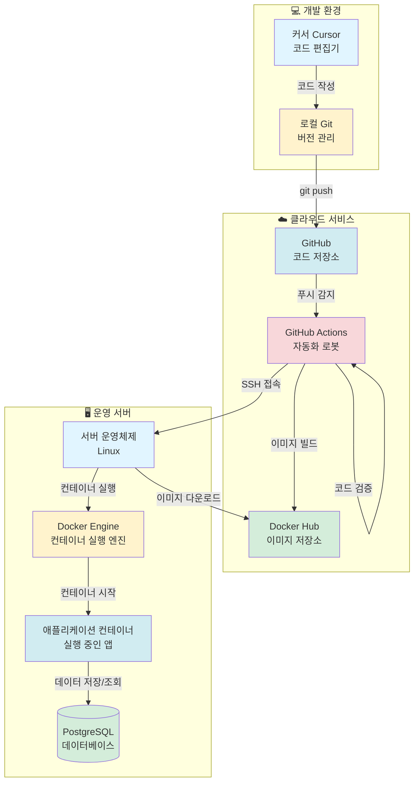
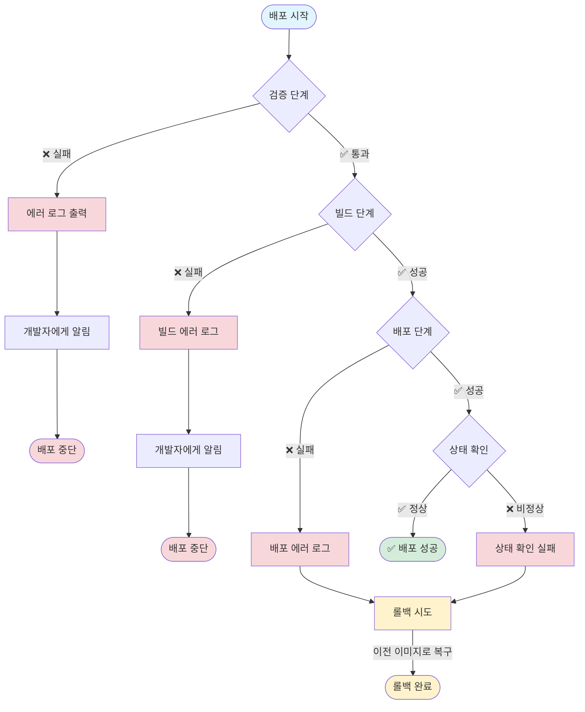
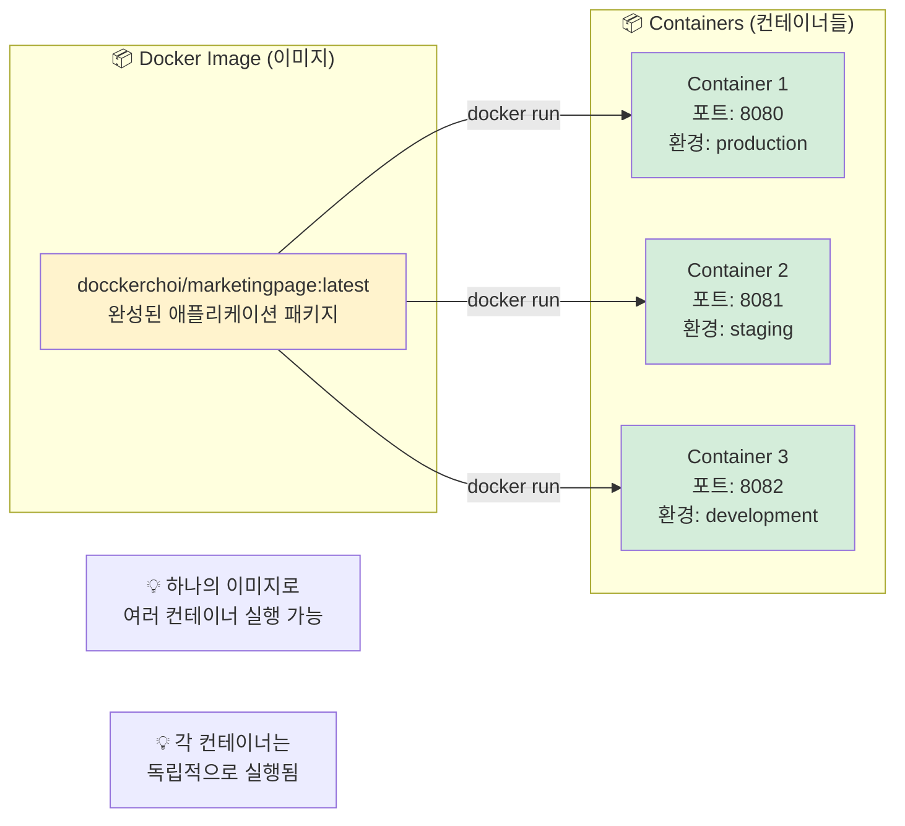

# 📊 개발-배포 전체 과정 Mermaid 다이어그램

이 문서는 개발부터 배포까지의 전체 과정을 Mermaid 다이어그램으로 시각화한 것입니다.

---

## 1. 전체 시퀀스 다이어그램 (개발자 관점)



---

## 2. Docker 빌드 과정 상세 다이어그램



---

## 3. GitHub Actions 워크플로우 상세 다이어그램

```mermaid
flowchart LR
    Trigger([git push origin main]) -->|트리거| Actions[🤖 GitHub Actions 시작]
    
    Actions --> Job1[Job 1: validate<br/>코드 검증]
    Job1 --> Step1_1[코드 체크아웃]
    Step1_1 --> Step1_2[Node.js 설치]
    Step1_2 --> Step1_3[npm ci]
    Step1_3 --> Step1_4[TypeScript 체크]
    Step1_4 --> Step1_5[빌드 테스트]
    Step1_5 -->|✅ 통과| Job2[Job 2: build-and-push<br/>Docker 이미지 빌드]
    Step1_5 -->|❌ 실패| Fail1([❌ 중단])
    
    Job2 --> Step2_1[Docker Hub 로그인]
    Step2_1 --> Step2_2[Git 커밋 시간 가져오기]
    Step2_2 --> Step2_3[Dockerfile 읽기]
    Step2_3 --> Step2_4[이미지 빌드]
    Step2_4 --> Step2_5[Docker Hub 푸시]
    Step2_5 -->|✅ 완료| Job3[Job 3: deploy<br/>서버 배포]
    Step2_5 -->|❌ 실패| Fail2([❌ 중단])
    
    Job3 --> Step3_1[SSH 키 설정]
    Step3_1 --> Step3_2[SSH 연결 테스트]
    Step3_2 -->|✅ 성공| Step3_3[서버에 명령 전달]
    Step3_2 -->|❌ 실패| Fail3([❌ 중단])
    
    Step3_3 --> Success([✅ 배포 완료!])
    
    style Trigger fill:#e1f5ff
    style Actions fill:#fff3cd
    style Job1 fill:#d1ecf1
    style Job2 fill:#d1ecf1
    style Job3 fill:#d1ecf1
    style Success fill:#d4edda
    style Fail1 fill:#f8d7da
    style Fail2 fill:#f8d7da
    style Fail3 fill:#f8d7da
```



---

## 4. 서버 배포 과정 상세 다이어그램



---

## 5. Docker 개념 다이어그램 (비유: 집 짓기)



---

## 6. Git 워크플로우 다이어그램

```mermaid
flowchart LR
    subgraph 로컬["💻 로컬 컴퓨터 (커서)"]
        작업공간[작업 공간<br/>Working Directory]
        스테이징[스테이징 영역<br/>Staging Area]
        로컬저장소[로컬 Git 저장소<br/>Local Repository]
    end
    
    subgraph 원격["☁️ GitHub (원격 저장소)"]
        GitHub저장소[GitHub 저장소<br/>Remote Repository]
    end
    
    작업공간 -->|git add .| 스테이징
    Note1["💡 변경사항을<br/>기록할 준비"]
    
    스테이징 -->|git commit -m "메시지"| 로컬저장소
    Note2["💡 현재 상태를<br/>사진으로 찍기"]
    
    로컬저장소 -->|git push origin main| GitHub저장소
    Note3["💡 클라우드에<br/>사진 업로드"]
    
    GitHub저장소 -->|git pull origin main| 작업공간
    Note4["💡 최신 사진<br/>다운로드"]
    
    style 작업공간 fill:#e1f5ff
    style 스테이징 fill:#fff3cd
    style 로컬저장소 fill:#d1ecf1
    style GitHub저장소 fill:#d4edda
```

---

## 7. 전체 시스템 아키텍처 다이어그램



---

## 8. 시간 순서별 전체 과정 타임라인

```mermaid
gantt
    title 개발-배포 전체 과정 타임라인
    dateFormat X
    axisFormat %s초
    
    section 로컬 개발
    코드 작성/수정           :0, 300
    git add .               :300, 10
    git commit              :310, 10
    git push                :320, 30
    
    section GitHub Actions
    코드 검증 (validate)    :350, 120
    Docker 이미지 빌드      :470, 180
    서버 배포 (deploy)      :650, 120
    
    section 서버 작업
    코드/이미지 다운로드    :650, 60
    컨테이너 재시작         :710, 30
    상태 확인               :740, 10
    
    section 완료
    배포 완료               :750, 0
```



---

## 9. 에러 처리 및 롤백 과정



---

## 10. Docker 이미지와 컨테이너의 관계



---

## 📝 사용 방법

이 다이어그램들은 다음 도구에서 볼 수 있습니다:

1. **GitHub**: GitHub의 마크다운 뷰어에서 자동으로 렌더링됩니다
2. **VS Code**: Mermaid 확장 프로그램 설치 시 미리보기 가능
3. **온라인 에디터**: https://mermaid.live 에서 코드를 붙여넣어 확인 가능
4. **Notion, Obsidian**: Mermaid를 지원하는 에디터에서 사용 가능

---

## 🎯 각 다이어그램의 용도

- **다이어그램 1**: 전체 과정을 한눈에 보기
- **다이어그램 2**: Docker 빌드 과정 이해하기
- **다이어그램 3**: GitHub Actions 워크플로우 이해하기
- **다이어그램 4**: 서버 배포 과정 이해하기
- **다이어그램 5**: Docker 개념 이해하기 (비유)
- **다이어그램 6**: Git 워크플로우 이해하기
- **다이어그램 7**: 전체 시스템 구조 이해하기
- **다이어그램 8**: 시간 순서 이해하기
- **다이어그램 9**: 에러 처리 방법 이해하기
- **다이어그램 10**: 이미지와 컨테이너 관계 이해하기

---

## 💡 학습 팁

1. **처음 보는 사람**: 다이어그램 1, 5, 6부터 시작하세요
2. **Docker 학습**: 다이어그램 2, 5, 10을 함께 보세요
3. **GitHub Actions 학습**: 다이어그램 3을 자세히 보세요
4. **배포 과정 학습**: 다이어그램 4를 자세히 보세요
5. **전체 이해**: 다이어그램 7로 전체 구조를 파악하세요


