# Docker 완벽 이해하기 - 초보자를 위한 실전 가이드

> Docker가 뭔지 모르는 초보자를 위한 완벽 가이드

## 📋 목차

1. [Docker란 무엇인가?](#docker란-무엇인가)
2. [직접 실행 vs Docker 실행](#직접-실행-vs-docker-실행)
3. [볼륨 마운트 완벽 이해](#볼륨-마운트-완벽-이해)
4. [포트 설정과 충돌 해결](#포트-설정과-충돌-해결)
5. [Docker Hub와 자동 배포](#docker-hub와-자동-배포)
6. [이미지 최적화 (.dockerignore)](#이미지-최적화-dockerignore)
7. [실전 팁과 주의사항](#실전-팁과-주의사항)

---

## 🐳 Docker란 무엇인가?

### 가장 쉬운 비유: 포장된 상자

Docker는 **포장된 상자**입니다. 상자 안에 애플리케이션이 들어있고, 어디서든 같은 상자를 열면 똑같이 작동합니다.

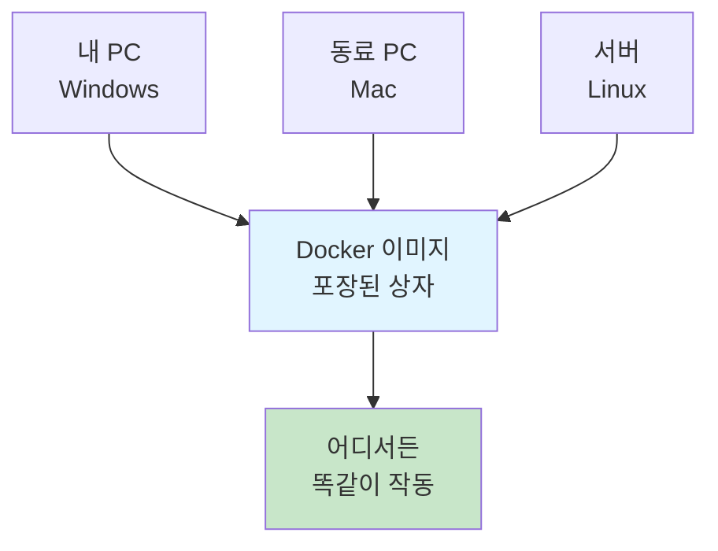

### 컨테이너 = 가상의 집

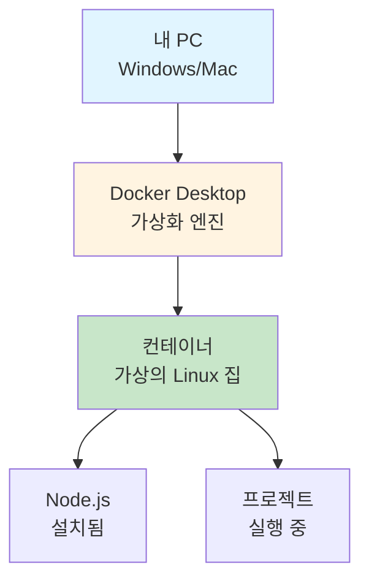

### 핵심 개념

| 개념 | 설명 | 비유 |
|------|------|------|
| **Docker Desktop** | Docker를 실행하는 프로그램 | 상자 관리자 |
| **이미지** | 애플리케이션과 환경이 담긴 템플릿 | 상자 설계도 |
| **컨테이너** | 이미지를 실행한 것 | 실제 상자 |
| **볼륨 마운트** | 폴더를 연결하는 것 | 창문 |

---

## 💻 직접 실행 vs Docker 실행

### 직접 실행 = 내 집에서 살기

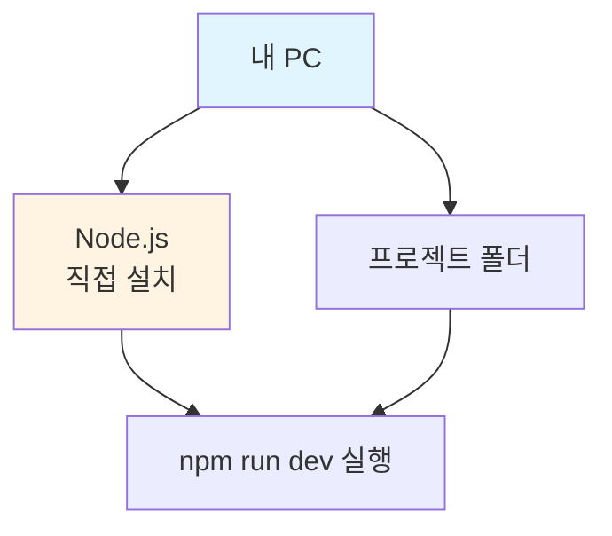

**특징**:
- 내 PC에 직접 설치
- 내 PC 환경에 의존
- 다른 PC에서는 안 될 수 있음

### Docker 실행 = 포장된 집

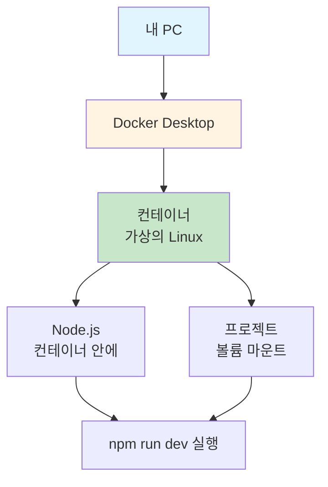

**특징**:
- 가상 환경에서 실행
- 어디서든 똑같이 작동
- 내 PC와 분리됨

### 비교표

| 항목 | 직접 실행 | Docker 실행 |
|------|----------|-------------|
| 실행 위치 | 내 PC | 컨테이너 (가상 환경) |
| Node.js 위치 | 내 PC에 설치 | 컨테이너 안에 설치 |
| 파일 접근 | 직접 접근 | 볼륨 마운트로 접근 |
| 환경 의존성 | 있음 | 없음 (컨테이너 안에서 동일) |
| 다른 PC에서 | 안 될 수 있음 | 똑같이 작동 |

---

## 📁 볼륨 마운트 완벽 이해

### 볼륨 마운트 = 폴더 연결하기

가장 쉬운 비유: **USB 메모리** 또는 **창문**


### 실제 설정 예시

```yaml
volumes:
  - ./blog-posts:/app/blog-posts
```

**의미**:
- `./blog-posts` = 내 PC의 폴더
- `:/app/blog-posts` = 컨테이너 안의 폴더
- `:` = 연결 (마운트)

### 볼륨 마운트 시점

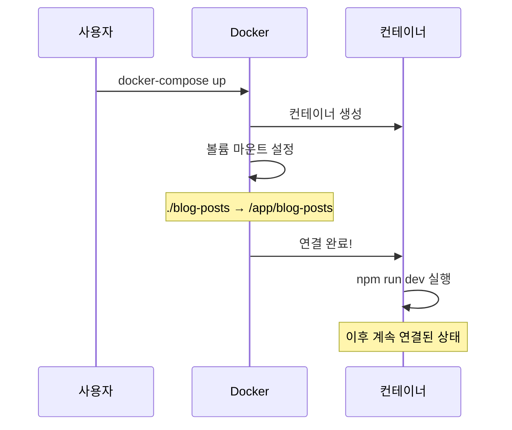

**중요**: 볼륨 마운트는 **컨테이너 시작 시 한 번만** 설정되고, 이후 계속 연결된 상태입니다.

### 파일 변경 감지 흐름

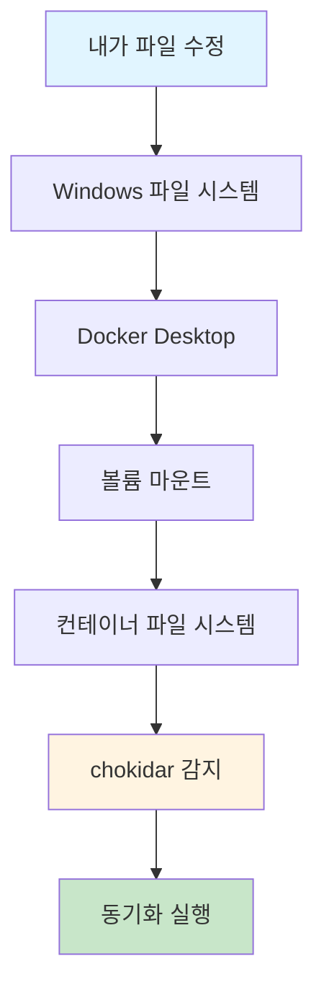

**동작 원리**:
1. 내가 파일 수정
2. Windows 파일 시스템이 변경 감지
3. Docker Desktop이 볼륨 마운트를 통해 변경 감지
4. 컨테이너 안의 파일도 업데이트
5. chokidar가 변경 감지 (polling 방식)
6. 자동 동기화 실행

### 양방향 동기화

```
[내 PC]                    [컨테이너]
  │                          │
  │  파일 수정                │
  │  ────────────────────→   │
  │                          │
  │                          │  파일 수정
  │  ←────────────────────   │
  │                          │
```

**특징**: 양방향으로 실시간 동기화됩니다.

---

## 🔌 포트 설정과 충돌 해결

### 포트 매핑 이해하기


### 포트 설정 비교

| 실행 방법 | 명령어 | 접속 포트 | 컨테이너 내부 포트 |
|----------|--------|----------|-------------------|
| **Docker 개발** | `docker-compose -f docker-compose.dev.yml up` | **5001** | 5000 |
| **Docker 프로덕션** | `docker-compose up` | **5000** | 8080 |
| **로컬 직접** | `npm run dev` | **5000** | - |

### 포트 충돌 해결

#### 문제 상황

```
[Docker 프로덕션 실행 중]
  └─ 포트 5000 사용 중
  
[로컬 서버 실행 시도]
  └─ 포트 5000 사용 시도
  └─ ❌ 충돌!
```

#### 해결 방법

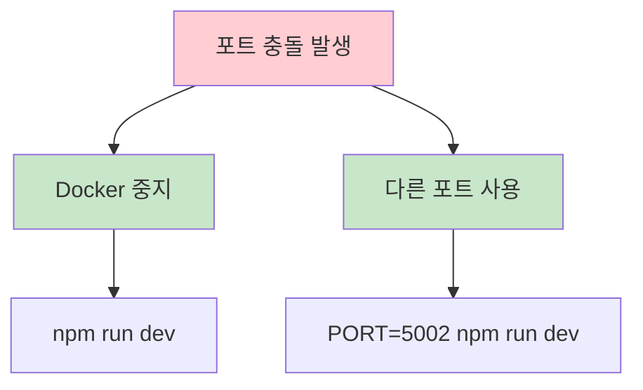

**해결책**:
1. Docker 중지 후 로컬 실행
2. 로컬 서버를 다른 포트로 실행 (`PORT=5002 npm run dev`)

---

## 🚀 Docker Hub와 자동 배포

### Docker Hub란?

Docker Hub는 **Docker 이미지를 저장하는 클라우드 저장소**입니다. GitHub와 비슷하지만 이미지를 저장합니다.

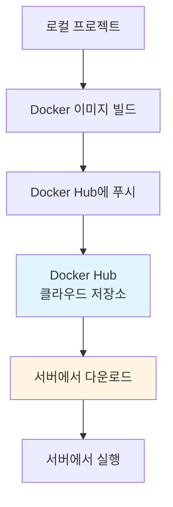

### 자동 배포 흐름

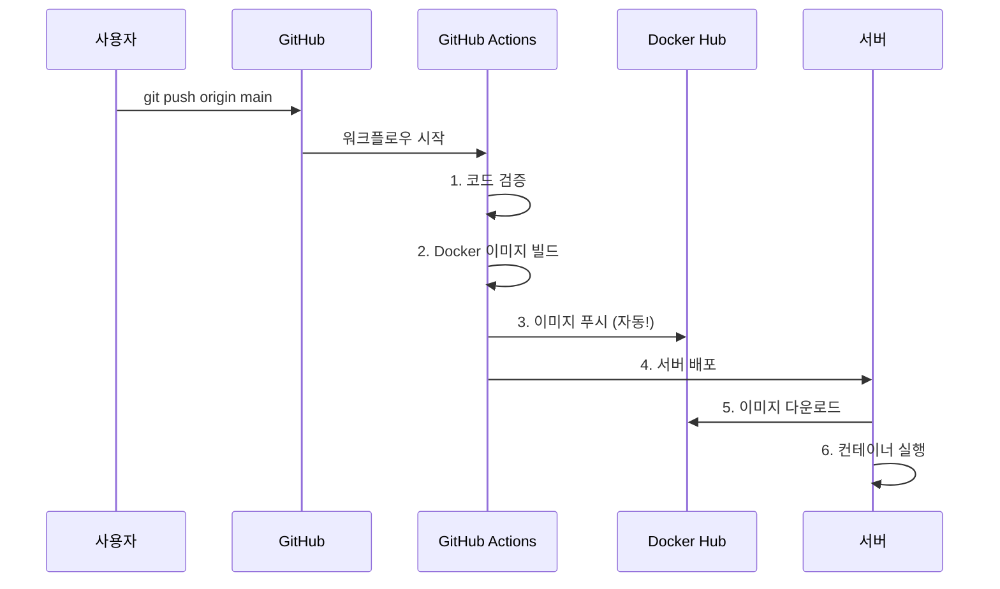

### 반영 시점

| 시점 | 동작 |
|------|------|
| **git push** | GitHub에 코드 푸시 |
| **자동 실행** | GitHub Actions 시작 (약 2-5분) |
| **Docker Hub 반영** | 이미지 빌드 및 푸시 완료 |
| **서버 배포** | 서버에 자동 배포 |

**중요**: 직접 반영할 필요 없습니다! `git push`만 하면 자동으로 반영됩니다.

---

## 🎯 이미지 최적화 (.dockerignore)

### .dockerignore란?

`.dockerignore`는 Docker 이미지 빌드 시 **제외할 파일/폴더를 지정**하는 파일입니다. `.gitignore`와 비슷합니다.

### 왜 필요한가?

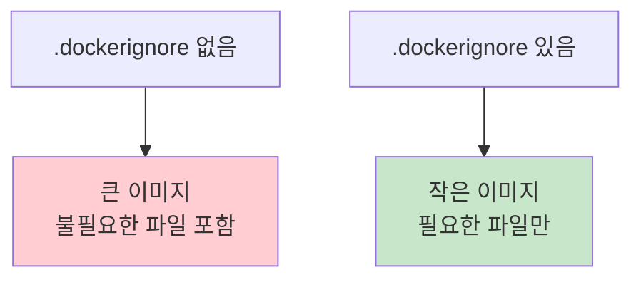

### 볼륨 마운트를 사용할 때

```
[이미지 빌드 시]
  └─ blog-posts 포함 (10MB)
  └─ 이미지 크기: 300MB

[프로덕션 실행 시]
  └─ 볼륨 마운트로 덮어씌움
  └─ 이미지의 blog-posts: 사용 안 됨 ❌
```

**문제점**:
- 불필요한 용량 사용
- 빌드 시간 증가
- 업로드 시간 증가

### 최적화 후

```
[이미지 빌드 시]
  └─ blog-posts 제외
  └─ 이미지 크기: 290MB (-10MB)

[프로덕션 실행 시]
  └─ 볼륨 마운트만 사용
  └─ 서버의 blog-posts 사용 ✅
```

**장점**:
- 이미지 크기 감소
- 빌드 시간 단축
- 업로드 시간 단축

### .dockerignore 예시

```dockerignore
node_modules
dist
.env
.env.local
.git
.DS_Store
*.log
public/uploads
attached_assets
blog-posts  # 볼륨 마운트 사용 시 제외
```

---

## 💡 실전 팁과 주의사항

### Docker Desktop은 항상 켜져있어야 함

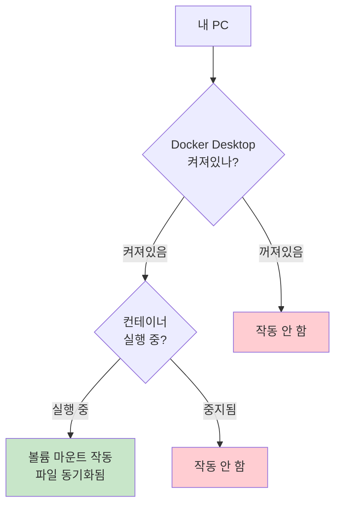

### 컨테이너는 리눅스 환경

| 항목 | 설명 |
|------|------|
| **내 PC** | Windows/Mac 가능 |
| **컨테이너 안** | 리눅스 환경 |
| **이유** | Docker Desktop이 가상화로 리눅스 환경 제공 |

**비유**: 내 집은 Windows지만, 상자 안(컨테이너)은 리눅스입니다.

### 볼륨 마운트 vs Git

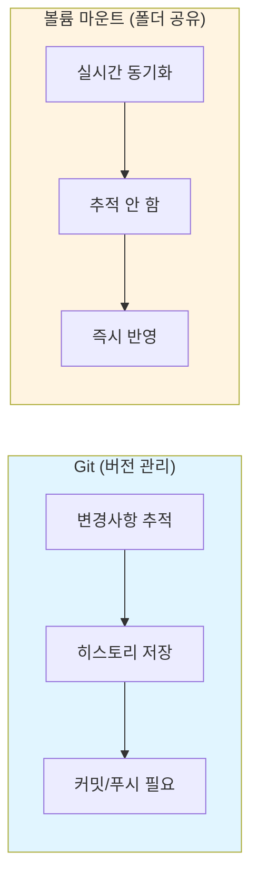

**차이점**:
- **Git**: 버전 관리 (추적, 히스토리)
- **볼륨 마운트**: 폴더 공유 (실시간 동기화)

### 파일 변경 감지 (chokidar)

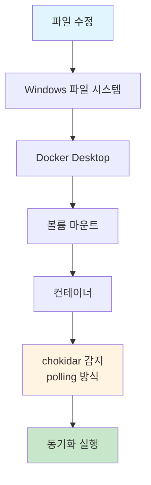

**Polling 방식**: 주기적으로 파일을 확인하여 변경을 감지합니다. Docker 환경에서 안정적으로 작동합니다.

---

## 🎓 핵심 정리

### Docker의 핵심 개념

1. **컨테이너 = 가상의 집**
   - 내 PC는 Windows/Mac 가능
   - 컨테이너 안은 리눅스 환경
   - 어디서든 똑같이 작동

2. **볼륨 마운트 = 폴더 연결**
   - 내 PC 폴더 ↔ 컨테이너 폴더
   - 실시간 동기화
   - 컨테이너 시작 시 한 번만 설정

3. **Docker Hub = 이미지 저장소**
   - `git push`만 하면 자동 반영
   - 직접 작업 불필요
   - 서버에서 자동 다운로드

4. **이미지 최적화**
   - `.dockerignore`로 불필요한 파일 제외
   - 볼륨 마운트 사용 시 이미지에 포함 불필요
   - 이미지 크기 감소

### 실전 체크리스트

- [ ] Docker Desktop 설치 및 실행 확인
- [ ] 포트 충돌 확인 (5000 vs 5001)
- [ ] 볼륨 마운트 설정 확인
- [ ] `.dockerignore` 최적화
- [ ] GitHub Actions 자동 배포 확인

---

## 📚 다음 단계

이제 Docker를 이해했으니, 다음을 학습해보세요:

1. **Docker Compose**: 여러 컨테이너 관리
2. **Docker 네트워크**: 컨테이너 간 통신
3. **Docker 볼륨**: 데이터 영구 저장
4. **Kubernetes**: 컨테이너 오케스트레이션

---

**작성일**: 2025년 1월 15일  
**태그**: #Docker #컨테이너 #개발환경 #배포 #DevOps #인프라

