# React + TypeScript + Express 풀스택 프로젝트 구조 완벽 이해하기

> jQuery에서 React로 넘어온 개발자를 위한 실전 가이드

## 📋 목차

1. [프로젝트 전체 구조](#프로젝트-전체-구조)
2. [React 컴포넌트 구조](#react-컴포넌트-구조)
3. [API 호출 흐름](#api-호출-흐름)
4. [데이터베이스 연결 흐름](#데이터베이스-연결-흐름)
5. [개발 모드 vs 프로덕션 모드](#개발-모드-vs-프로덕션-모드)
6. [Express 프레임워크 이해하기](#express-프레임워크-이해하기)

---

## 🏗️ 프로젝트 전체 구조

이 프로젝트는 **모노레포(Monorepo)** 구조로, 프론트엔드와 백엔드가 하나의 프로젝트 안에 함께 있습니다.

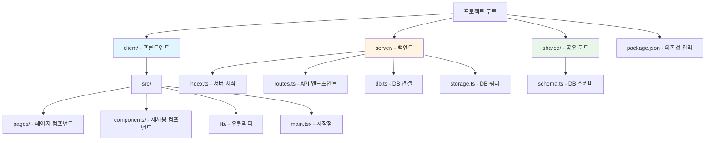

### 폴더별 역할

| 폴더 | 역할 | 기술 스택 |
|------|------|-----------|
| `client/` | 프론트엔드 | React + TypeScript + Vite |
| `server/` | 백엔드 | Express + TypeScript |
| `shared/` | 공유 코드 | TypeScript (스키마 정의) |

### 주요 특징

- **하나의 package.json**: 프론트엔드와 백엔드 의존성을 한 곳에서 관리
- **공유 타입**: `shared/schema.ts`로 프론트와 서버가 같은 타입 사용
- **단일 포트**: 개발/프로덕션 모두 하나의 포트(5000)에서 실행

---

## 🧩 React 컴포넌트 구조

jQuery에서 React로 넘어올 때 가장 큰 변화는 **컴포넌트 기반 구조**입니다.

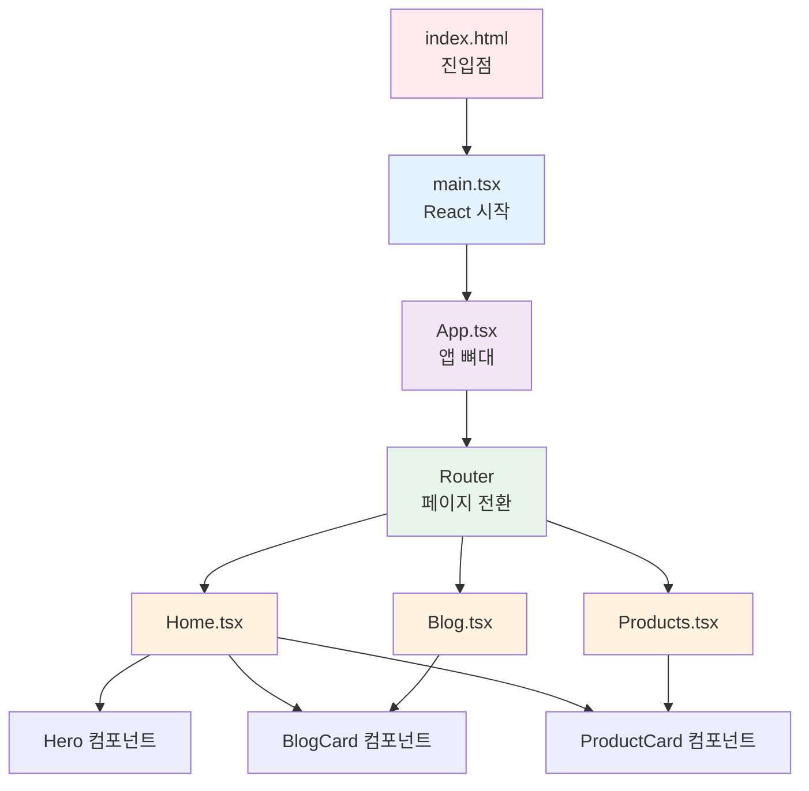

### jQuery vs React 비교

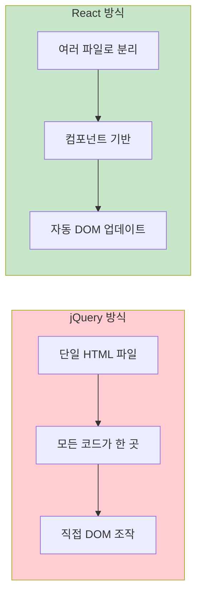

### 주요 차이점

#### jQuery 방식
```javascript
// 모든 코드가 하나의 HTML 파일에
$('#content').html('<div>' + data.title + '</div>');
```

#### React 방식
```typescript
// 컴포넌트로 분리
function BlogCard({ post }) {
  return <Card>{post.title}</Card>;
}
```

**장점**:
- 코드 재사용성 증가
- 유지보수 용이
- 타입 안정성 (TypeScript)
- 자동 업데이트

---

## 🔄 API 호출 흐름

`useQuery`를 사용한 API 호출의 전체 흐름을 시퀀스 다이어그램으로 표현했습니다.

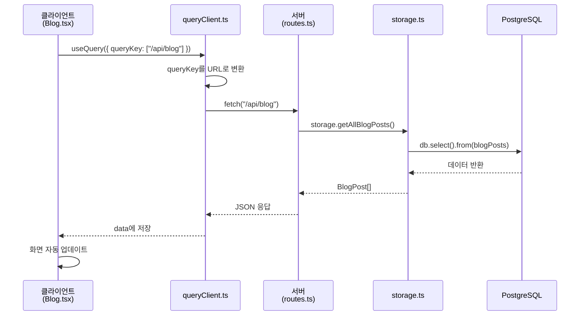

### 단계별 상세 설명

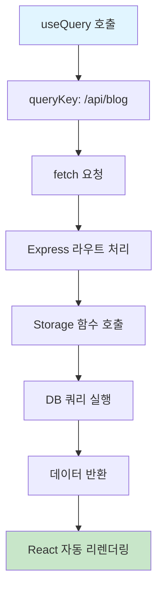

### 실제 코드 예시

#### 1. 클라이언트에서 호출
```typescript
// Blog.tsx
const { data: posts = [], isLoading } = useQuery<BlogPost[]>({
  queryKey: ["/api/blog"],
});
```

#### 2. queryClient가 HTTP 요청
```typescript
// queryClient.ts
async ({ queryKey }) => {
  const res = await fetch(queryKey.join("/")); // "/api/blog"
  return await res.json();
}
```

#### 3. 서버에서 처리
```typescript
// routes.ts
app.get("/api/blog", async (_req, res) => {
  const posts = await storage.getAllBlogPosts();
  res.json(posts);
});
```

#### 4. 데이터베이스 쿼리
```typescript
// storage.ts
async getAllBlogPosts() {
  return await db.select().from(blogPosts);
}
```

---

## 💾 데이터베이스 연결 흐름

데이터베이스 연결부터 쿼리 실행까지의 과정입니다.

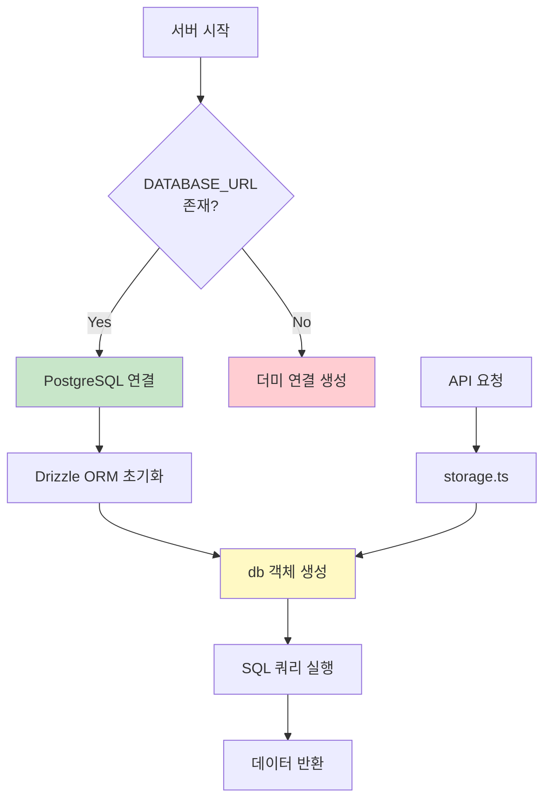

### 실제 코드 흐름

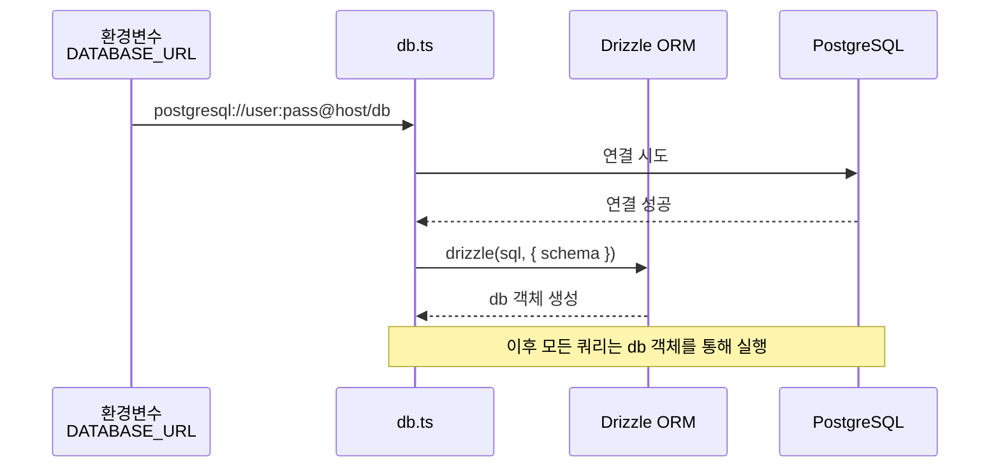

### DB 연결 코드

```typescript
// db.ts
const sql = postgres(process.env.DATABASE_URL);
const db = drizzle(sql, { schema });
```

**특징**:
- 환경변수로 연결 정보 관리
- Drizzle ORM으로 타입 안정성 보장
- 스키마 기반 쿼리

---

## 🛠️ 개발 모드 vs 프로덕션 모드

개발 모드와 프로덕션 모드의 차이를 시각화했습니다.

### 개발 모드 (npm run dev)

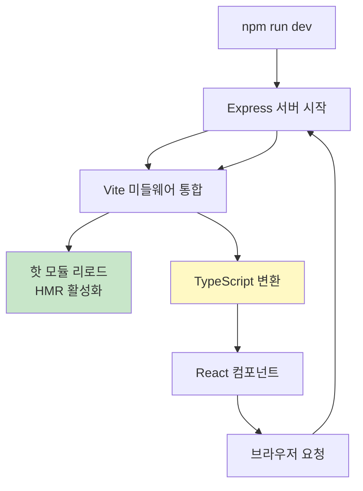

**특징**:
- 코드 변경 시 자동 리로드
- 소스맵 제공 (디버깅 용이)
- 빠른 개발 경험

### 프로덕션 모드 (npm run build + npm start)

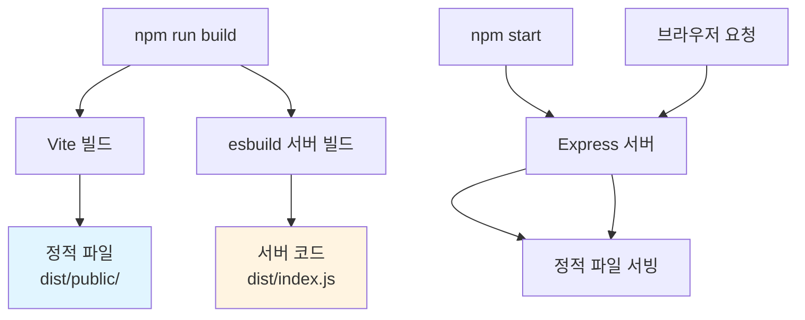

**특징**:
- 코드 최적화 및 압축
- 빠른 로딩 속도
- 프로덕션 환경에 최적화

### 모드별 비교

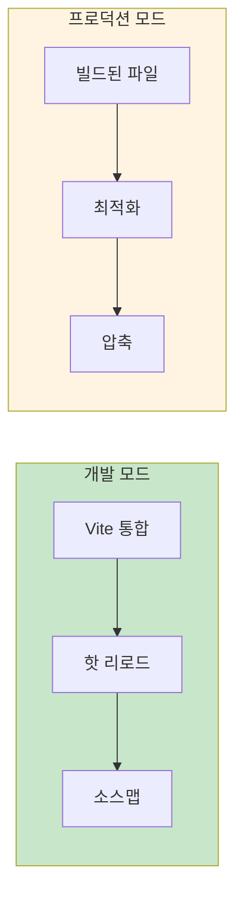

| 항목 | 개발 모드 | 프로덕션 모드 |
|------|----------|--------------|
| 빌드 | 실시간 변환 | 사전 빌드 |
| 리로드 | 핫 리로드 | 없음 |
| 최적화 | 없음 | 최적화 + 압축 |
| 디버깅 | 쉬움 (소스맵) | 어려움 |

---

## 🚀 Express 프레임워크 이해하기

Express는 TypeScript 언어가 아니라, **Node.js용 웹 프레임워크**입니다.

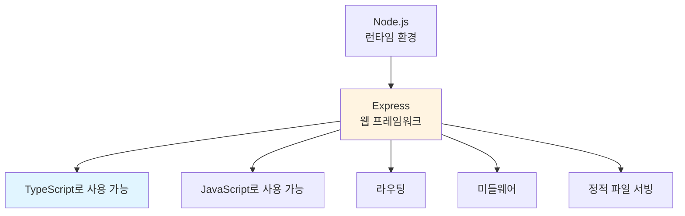

### Express vs 다른 프레임워크

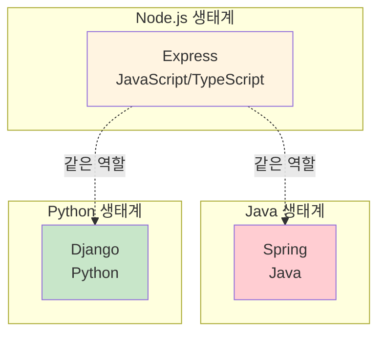

**핵심 정리**:
- Express = 웹 프레임워크 (도구)
- TypeScript = 프로그래밍 언어
- Express는 TypeScript로 사용 가능하지만, TypeScript 자체는 아님

### Express 라우팅 구조

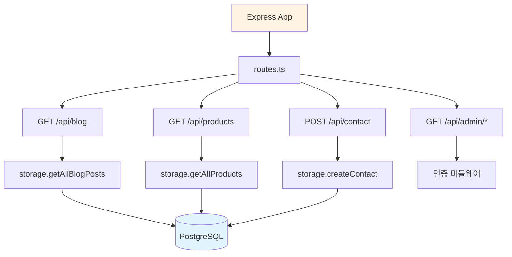

### Express 사용 예시

```typescript
// 서버 시작
const app = express();

// 라우트 정의
app.get("/api/blog", async (req, res) => {
  const posts = await storage.getAllBlogPosts();
  res.json(posts);
});

// 서버 실행
app.listen(5000);
```

---

## 📊 전체 아키텍처 다이어그램

프로젝트의 전체 아키텍처를 한눈에 볼 수 있는 다이어그램입니다.

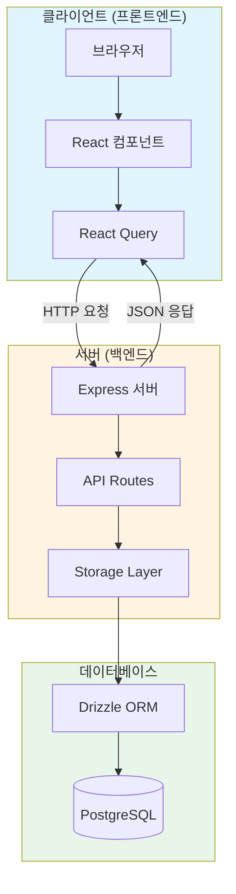

### 데이터 흐름

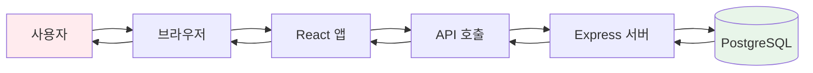

---

## 🎯 핵심 정리

### 1. 프로젝트 구조
- **모노레포**: 프론트엔드와 백엔드가 하나의 프로젝트
- **폴더 분리**: `client/`, `server/`, `shared/`로 역할 분리
- **공유 코드**: `shared/` 폴더로 타입과 스키마 공유

### 2. React 컴포넌트
- **컴포넌트 기반**: 재사용 가능한 부품으로 구성
- **자동 업데이트**: 데이터 변경 시 자동 리렌더링
- **파일 분리**: 각 컴포넌트가 독립적인 파일

### 3. API 호출
- **useQuery**: 간단한 API 호출 Hook
- **자동 캐싱**: 같은 데이터는 캐시에서 재사용
- **자동 리패치**: 필요 시 자동으로 데이터 갱신

### 4. 데이터베이스
- **Drizzle ORM**: TypeScript 친화적인 ORM
- **타입 안정성**: 스키마로 타입 보장
- **환경변수**: `DATABASE_URL`로 연결 관리

### 5. Express
- **웹 프레임워크**: Node.js용 서버 프레임워크
- **TypeScript 지원**: 타입 정의 제공
- **라우팅**: RESTful API 쉽게 구현

---

## 📚 다음 단계

이제 프로젝트 구조를 이해했으니, 다음을 학습해보세요:

1. **컴포넌트 만들기**: 새로운 컴포넌트 추가하기
2. **API 엔드포인트 추가**: 새로운 API 만들기
3. **데이터베이스 스키마**: 테이블 추가 및 수정
4. **인증 시스템**: 로그인/로그아웃 구현
5. **에러 처리**: 에러 핸들링 패턴

---

## 💡 실전 팁

### 개발 시 주의사항

1. **타입 안정성**: TypeScript를 최대한 활용하세요
2. **컴포넌트 재사용**: 작은 컴포넌트부터 만들기
3. **에러 처리**: 항상 에러 케이스를 고려하세요
4. **성능 최적화**: 불필요한 리렌더링 방지

### 디버깅 팁

1. **React DevTools**: 컴포넌트 상태 확인
2. **Network 탭**: API 호출 확인
3. **Console 로그**: 서버 로그 확인
4. **TypeScript 에러**: 타입 에러 먼저 해결

---

**작성일**: 2025년 1월 15일  
**태그**: #React #TypeScript #Express #풀스택 #웹개발 #프론트엔드 #백엔드 #아키텍처

