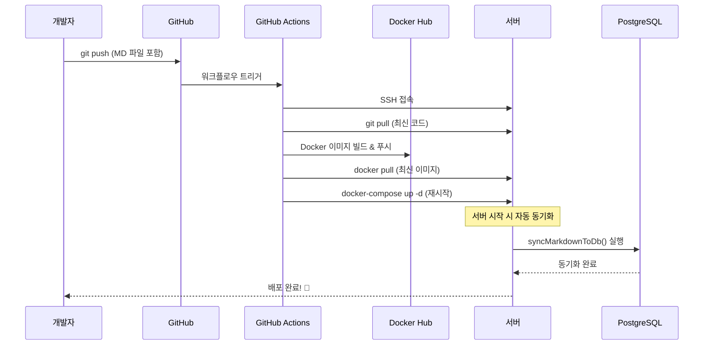

# 서버 배포와 마크다운 동기화 완벽 이해하기

> GitHub Actions로 자동 배포할 때 마크다운 파일이 DB에 자동으로 반영되는 과정을 쉽게 설명합니다.

## 🎯 문제 상황

블로그 MD 파일을 작성하고 Git에 푸시했는데, 서버에 반영이 안 되는 경우가 있습니다. 왜 그럴까요?

## 📋 개발 모드 vs 프로덕션 모드

### 개발 모드 (로컬 개발)

```typescript
// server/index.ts
if (app.get("env") === "development") {
  await syncMarkdownToDb();        // 1. 서버 시작 시 한 번 실행
  watchMarkdownFiles();            // 2. 파일 변경 감지 (계속 실행)
}
```

**특징:**
- ✅ 서버 시작 시 마크다운 파일 → DB 자동 동기화
- ✅ 파일 수정 시 실시간으로 DB에 반영
- ✅ 개발 중에 편리함

### 프로덕션 모드 (서버)

**현재 상태:**
```typescript
// 프로덕션 모드에서는 아무것도 실행 안 됨! ❌
```

**문제점:**
- ❌ 서버 시작 시 동기화 안 됨
- ❌ 파일 변경 감지 안 됨
- ❌ 수동으로 동기화해야 함

## 🔧 해결 방법

### 1. 프로덕션 모드에서도 초기 동기화

서버가 시작될 때 한 번만 동기화하도록 수정:

```typescript
// 개발 모드: 초기 동기화 + 파일 감시
if (app.get("env") === "development") {
  const { syncMarkdownToDb, watchMarkdownFiles } = await import('./sync-markdown');
  await syncMarkdownToDb();        // 서버 시작 시 한 번 실행
  watchMarkdownFiles();            // 파일 변경 감지 (계속 실행)
} 
// 프로덕션 모드: 초기 동기화만 (파일 감시는 안 함)
else {
  const { syncMarkdownToDb } = await import('./sync-markdown');
  await syncMarkdownToDb();        // 서버 시작 시 한 번만 실행
}
```

**왜 파일 감시는 안 하나요?**
- 개발 모드: 로컬에서 파일을 직접 수정 → 실시간 감시 필요
- 프로덕션 모드: 배포 시에만 파일 변경 → 서버 시작 시 한 번만 동기화하면 충분

### 2. GitHub Actions 동기화 순서

**현재 순서 (문제):**
```yaml
1. git pull
2. npm run sync-md-to-db (컨테이너 재시작 전) ❌
3. docker pull
4. docker-compose up -d (재시작)
```

**수정 후 순서 (해결):**
```yaml
1. git pull
2. docker pull
3. docker-compose up -d (재시작)
4. npm run sync-md-to-db (컨테이너 재시작 후) ✅
```

**왜 순서가 중요한가요?**
- 컨테이너가 재시작되면 새로운 코드가 실행됩니다
- 재시작 전에 동기화하면 오래된 코드로 실행될 수 있습니다
- 재시작 후에 동기화하면 최신 코드로 실행됩니다

## 📊 전체 흐름도



## 🎯 핵심 정리

### 개발 모드
- **초기 동기화**: ✅ 서버 시작 시
- **파일 감시**: ✅ 실시간 감지
- **용도**: 로컬 개발

### 프로덕션 모드 (수정 후)
- **초기 동기화**: ✅ 서버 시작 시
- **파일 감시**: ❌ 불필요 (배포 시에만 변경)
- **용도**: 실제 서버

## ✅ 최종 결과

1. **Git 푸시** → GitHub Actions 자동 실행
2. **서버 재시작** → 자동으로 마크다운 파일 → DB 동기화
3. **수동 작업 불필요** → 모든 것이 자동화됨!

## 💡 추가 팁

### 서버 재기동 중 화면 표시

서버가 재시작 중일 때 사용자에게 안내 화면을 보여줄 수 있습니다:

- API 요청 실패 시 자동 재시도
- "서버 재기동 중입니다" 메시지 표시
- 몇 초 후 자동으로 새로고침

이렇게 하면 사용자 경험이 훨씬 좋아집니다!

## 🔍 실제 동작 과정

### 1단계: Git 푸시
```bash
git add .
git commit -m "새 블로그 포스팅 추가"
git push origin main
```

### 2단계: GitHub Actions 자동 실행
- 코드 검증
- Docker 이미지 빌드
- Docker Hub에 푸시
- 서버에 SSH 접속

### 3단계: 서버 배포
- 최신 코드 가져오기 (`git pull`)
- 최신 Docker 이미지 가져오기 (`docker pull`)
- 컨테이너 재시작 (`docker-compose up -d`)

### 4단계: 자동 동기화
- 서버 시작 시 `syncMarkdownToDb()` 자동 실행
- 마크다운 파일 → DB 동기화 완료

### 5단계: 완료!
- 사용자가 웹사이트에서 새 포스팅 확인 가능

## 🚨 주의사항

1. **볼륨 마운트 필수**: `blog-posts` 폴더가 서버에 마운트되어 있어야 합니다
2. **파일 권한**: 서버에서 파일을 읽을 수 있는 권한이 있어야 합니다
3. **DB 연결**: 데이터베이스 연결이 정상이어야 합니다

## 📝 요약

- **개발 모드**: 초기 동기화 + 파일 감시 (실시간)
- **프로덕션 모드**: 초기 동기화만 (서버 시작 시)
- **GitHub Actions**: 컨테이너 재시작 후 동기화 실행
- **결과**: 모든 것이 자동화되어 수동 작업 불필요!

---

**다음 포스팅**: Docker 볼륨 마운트와 파일 동기화의 모든 것

